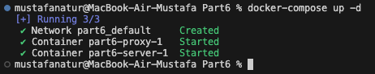
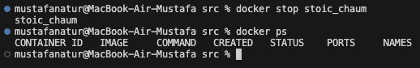

# Simple Docker

Введение в докер. Разработка простого докер образа для собственного сервера.

## Part 1. Готовый докер

В качестве конечной цели своей небольшой практики вы сразу выбрали написание докер образа для собственного веб сервера, а потому в начале вам нужно разобраться с уже готовым докер образом для сервера.
Ваш выбор пал на довольно простой **nginx**.

- Взять официальный докер образ с **nginx** и выкачать его при помощи `docker pull`

  

- Проверить наличие докер образа через `docker images`

  ```
  По умолчанию в docker images будут показаны все образы верхнего уровня, их репозиторий и теги, а также их размер.
  ```

  

- Запустить докер образ через `docker run -d [image_id|repository]`

  ```
  Команда docker run запускает команду в новом контейнере, при необходимости подтягивая образ и запуская контейнер.
  -d, --detach Запуск контейнера в фоновом режиме и печать идентификатора контейнера
  ```

  

- Проверить, что образ запустился через `docker ps`

  ```
  docker ps - cписок активных контейнеров
  ```

  

- Посмотреть информацию о контейнере через `docker inspect [container_id|container_name]`

  ```
  Docker inspect предоставляет подробную информацию о конструкциях, управляемых Docker. По умолчанию docker inspect выводит результаты в виде массива JSON.
  ```

  

- По выводу команды определить и поместить в отчёт размер контейнера, список замапленных портов и ip контейнера

  ```
  Если мы хотим взаимодействовать с контейнером Docker с нашей хост-машины, то нам необходимо иметь сопоставление портов.
  ```

  - Размер контейнера

    

  - Порты

    

  - IP контейнера

    

- Остановить докер образ через `docker stop [container_id|container_name]`
- Проверить, что образ остановился через `docker ps`

  

- Запустить докер с портами 80 и 443 в контейнере, замапленными на такие же порты на локальной машине, через команду _run_

  ```
  По умолчанию при создании или запуске контейнера с помощью docker create или docker run контейнер не раскрывает свои порты внешнему миру. Чтобы сделать порт доступным для сервисов за пределами Docker, используйте флаг --publish или -p. При этом на хосте создается правило брандмауэра, сопоставляющее порт контейнера с портом на хосте Docker для внешнего мира.
  ```

  

- Проверить, что в браузере по адресу _localhost:80_ доступна стартовая страница **nginx**

  

- Перезапустить докер контейнер через `docker restart [container_id|container_name]`
- Проверить любым способом, что контейнер запустился

  

---

## Part 2. Операции с контейнером

- Прочитать конфигурационный файл `nginx.conf` внутри докер контейнера через команду exec

  ```
  exec - выполнение команды в работающем контейнере
  laughing_keller - новое имя контейнера
  ```

  

- Создать на локальной машине файл nginx.conf
- Настроить в нем по пути /status отдачу страницы статуса сервера nginx

  ```
  Порядок работы nginx и его модулей определяется в конфигурационном файле. По умолчанию конфигурационный файл имеет имя nginx.conf и размещается в каталоге /usr/local/nginx/conf, /etc/nginx или /usr/local/etc/nginx.

  Далее, откройте конфигурационный файл. Конфигурационный файл по умолчанию уже включает в себя несколько примеров блока server, большей частью закомментированных. Для нашей текущей задачи лучше закомментировать все такие блоки и добавить новый блок server:
  ```

  

- Скопировать созданный файл nginx.conf внутрь докер образа через команду `docker cp`

  

- Перезапустить nginx внутри докер образа через команду exec

  

- Проверить, что по адресу localhost:80/status отдается страничка со статусом сервера nginx

  
  

- Экспортировать контейнер в файл container.tar через команду export
- Остановить контейнер

  

- Удалить образ через docker rmi `[image_id|repository]`, не удаляя перед этим контейнеры

  

- Удалить остановленный контейнер

  

- Импортировать контейнер обратно через команду `import`

  ```
  docker import [OPTIONS] file|URL|- [REPOSITORY[:TAG]]
  ```

  

  

- Запустить импортированный контейнер

  

- Проверить, что по адресу localhost:80/status отдается страничка со статусом сервера nginx

  

---

## Part 3. Мини веб-сервер

- Написать мини сервер на C и FastCgi, который будет возвращать простейшую страничку с надписью Hello World!

  

- Запустить написанный мини сервер через spawn-fcgi на порту 8080

  

- Запустить сервер и скопировать файл конфигурации и файл сервера

  

- Настраиваем окружение

  ```
  apt-get update
  apt-get install -y gcc spawn-fcgi libfcgi-dev
  ```

- Скомпилируем и запустим сервер

  

- Результат

  

- Положить файл nginx.conf по пути ./nginx/nginx.conf (это понадобится позже)

  

---

## Part 4. Свой докер

Написать свой докер образ, который:

1. собирает исходники мини сервера на FastCgi из Части 3

2. запускает его на 8080 порту

3. копирует внутрь образа написанный ./nginx/nginx.conf

4. запускает nginx.

   
   

- Собрать написанный докер образ через docker build при этом указав имя и тег

  

- Проверить через docker images, что все собралось корректно

  

- Запустить собранный докер образ с маппингом 81 порта на 80 на локальной машине и маппингом папки ./nginx внутрь контейнера по адресу, где лежат конфигурационные файлы nginx'а (см. Часть 2)

  

- Проверить, что по localhost:80 доступна страничка написанного мини сервера

  

  

- Дописать в ./nginx/nginx.conf проксирование странички /status, по которой надо отдавать статус сервера nginx

  

- Проверить, что теперь по localhost:80/status отдается страничка со статусом nginx

  

---

## Part 5. Dockle

- Просканировать образ из предыдущего задания через dockle `[image_id|repository]`

  

- Исправить образ так, чтобы при проверке через dockle не было ошибок и предупреждений

  

---

## Part 6. Базовый Docker Compose

- Написать файл docker-compose.yml, с помощью которого:

  - Поднять докер контейнер из Части 5 (он должен работать в локальной сети, т.е. не нужно использовать инструкцию EXPOSE и мапить порты на локальную машину)

  - Поднять докер контейнер с nginx, который будет проксировать все запросы с 8080 порта на 81 порт первого контейнера

    

    

    

- Остановить все запущенные контейнеры

  

- Собрать и запустить проект с помощью команд `docker-compose build` и `docker-compose up`

  

  

  

- Проверить, что в браузере по localhost:80 отдается написанная вами страничка, как и ранее

  
